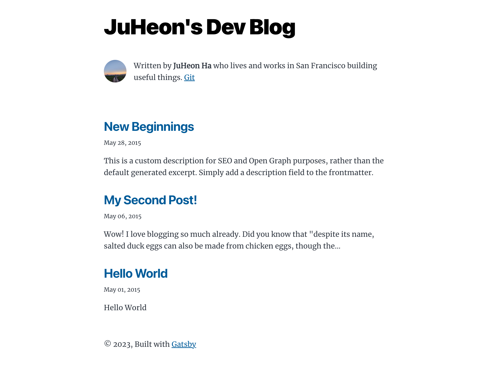
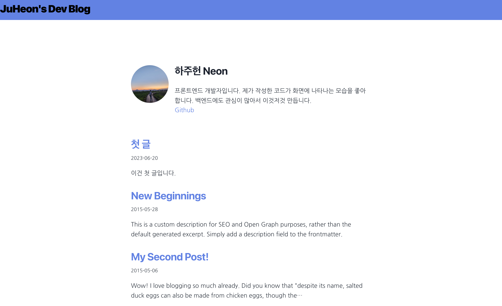

## 블로그 템플릿

블로그를 이제 막 개설해서인지 아직은 `gatsby` 프레임워크가 어떻게 동작하는지 파악하고 있는 단계다. 그러면서도 블로그 꾸미기는 빼먹을 수 없는데, 이는 역시 내가 프론트엔드 개발자이기도 하고 velog나 medium 같은 플랫폼보다 커스텀할 수 있는 폭이 넓은 gatsby를 기술 블로그로 선택한 이상 꾸미기는 선택이 아닌 거의 필수라고 생각한다.

첫 글에서도 언급했다시피 다른 개발자분들의 gatsby 블로그를 구경다니면서도 한 가지 의아했던 점 중 하나는, UI가 하나같이 매우 흡사하다는 점이었다. 상단에는 full-width의 top-fixed-header가 존재하고 바로 밑에는 자신의 프로필과 간단한 소개글, 그 밑에 포스팅이 나열되는 방식이었다. 이게 무슨 정해진 규칙같은 게 있는 건 지, 아니면 이런 형식으로 제공되는 템플릿이 있는 지는 모르겠는데 일단 나는 나만의 방식으로 꾸미기로 했다.

_(나중에 알게된 사실인데, [Jbee](https://jbee.io)님이 배포하시는 [gatsby-starter-bee](https://github.com/JaeYeopHan/gatsby-starter-bee)가 있었다. 아마 내가 구경한 블로그의 상당수는 이를 fork한 것으로 보인다. 이 블로그도 fork해서 만드는 걸 고려해보긴 했지만, 일단은 제로베이스부터 만들고 싶었다. 대신에 각종 기능을 어떻게 구현했는지에 대한 코드는 많이 참고하고 있다. Jbee님 감사합니다.)_

## 어떻게 꾸밀까

나는 `gatsby-starter-blog`를 fork해서 갖고왔다. 처음 `npm run develop` 커맨드로 실행하게 되면 뿌듯함과 함께 어떻게 꾸며야할까에 대한 막막함이 몰려온다.

<em>
처음으로 블로그를 실행하면 마주하게 되는 화면.사실상 허허벌판 상태이다.
</em>

 

일단 해야할 일을 정해보자.

#### 1. primary-color 정하기

UI의 통일성을 위해서는 꼭 필요하다. 내가 평소에 좋아하는 색인 `DodgerBlue` 계열의 색을 rgb-picker로 찍어왔다.

#### 2. 내 소개글(profile) 작성하기

이건 간단하다. 한두줄 정도의 소개글과 프로필사진만 업로드하면 된다.

#### 3. 헤더 스타일 변경하기

다른 사람들의 블로그의 헤더가 모두 top-fixed에 full-width인 걸 보아하니, 나도 왠지 그래야만 할 것 같은 기분이 들었다. background-color는 primary-color로 적용하니 꽤 볼만해졌다. 그렇지만 점점 갈수록 다른 블로그들이랑 너무 비슷해져가는데...? 이럴거면 그냥 처음부터 `gatsby-start-bee`를 받아서 쓸 걸 그랬나...

여기까지 적용해본 결과, 아래와 같이 나온다.

참고 볼 만한 수준은 되었지만, 아직 이정도로는 부족하다.

#### 4. 댓글 작성 기능

`utterance`를 활용하면 된다. 블로그 댓글을 위한 별도의 public 레포지토리를 만들고나서 연동을 하면 해당 레포지토리의 issue에 글이 올라가게 되고, 이를 댓글처럼 활용할 수 있는 방식이다.

#### 5. 폰트 변경하기

기본으로 깔려있는 폰트는 별로 예쁘지가 않았다. 구글링으로 폰트 변경하는 법을 찾아보니, `@fontsource`에서 제공해주는 폰트를 `npm`기반으로 설치할 수 있다고 하더라. 기본 제공되는 한글 폰트는 가짓수가 그리 많지는 않지만 나는 가장 무난한 `Noso Sans`를 선택했다.

#### 6. 코드블럭 스타일 변경하기

코드블럭 역시 기본으로 제공되는 스타일이 마음에 들지 않았다. 구글링해보니 `gatsby-remark-highlight-code`라는 플러그인을 제공해주고 있더라. 이런 문제들을 미리 만나고 해결해주시고 블로그에 글을 남겨주신 모든 분들께 감사드린다.

#### 7. 모바일 환경도 신경쓰기

PC 환경에서는 잘 보이는데, 모바일에서 확인해보니 스타일이 깨지는 부분이 많았다. 사실 기술블로그를 주로 읽는 독자들의 대다수는 PC로 접속할 것으로 예상은 되지만, 그렇다고 모바일을 소홀히 할 변명이 되지는 않는다. 당연히 모바일에서도 잘 보여야한다. 헤더의 z-index나 element들의 간격을 조정해서 해결하였다.

#### 8. 나만의 독특함(?)은 뭐가 있을까

사실 여기까지만 진행해도 나름 그럴싸한 UI가 완성되었다. 그렇지만 뭔가 좀 아쉽다. 다른 블로그를 너무 열심히 참고하는 바람에 내 블로그만의 특색이 사라졌다고나 할까? 그래도 나름 뭔가 좀 hooking 한 무언가 있었으면 좋겠다.

> 음, 생각을 해보자... 나만의 무언가....

그러다가 문득 나의 닉네임이 Neon 이니, 네온사인같은 효과를 적용해보면 좋겠다는 생각이 떠올랐다. 바로 `neon sign effect in css`로 검색해보니 아니나 다를까, 수많은 구현 방법이 나와있었다. 기본적으로 text-shadow를 활용해서 뒤에 어두운 배경을 갖다대면 네온사인처럼 주변을 밝히는 효과를 낼 수 있었다. 더 참신한 건 animation,keyframes을 이용해서 네온사인이 깜빡이는 효과까지 만들 수 있다!  
처음 이걸 본 순간 확 꽂혀서 바로 내 블로그에 도입해보고 싶다는 생각이 들었다. 어려운 테크닉이 들어간 방식도 아니어서 단번에 보고 따라할 수 있었다. 혹시나 코드가 궁금하신 분들은 `header-effect.css`를 참고하면 된다.  
대신에 깜빡이는 효과는 눈이 아프거나 정신 사납다고 느낄 수도 있으니 독자에게 비활성화할 수 있는 방법은 제공해야되겠다고 생각했다. 상태관리 라이브러리를 써야하나 고민했는데 그렇게 복잡할 필요는 없을 것 같다고 판단하여 그냥 localStorage단에서 boolean값을 저장하여 제어하는 방식을 선택했다.

## 앞으로 적용해 볼 기능들

#### 카테고리

`gatsby-starter-bee`에서는 기본으로 제공해주는 기능인데, 나는 직접 구현해야한다. 구현 원리는 슥 봤는데 어느정도는 이해하긴 했다. 카테고리 목록을 `string[]`형태의 constant로 미리 선언해놓고, `content/blog/`밑의 경로에 선언해둔 카테고리를 디렉토리로 만들어서 포스팅을 집어 넣는다. 그리고 `useCategory` hook을 호출해서 특정 카테고리 밑에 있는 포스팅들을 다 묶어주는 방식인 것 같다. 머리로는 이해했는데 구현은 한번 해봐야 할 것 같다.

#### 다크모드

카테고리 기능만큼 우선순위가 높은 기능은 아니라고 생각한다. 이 역시도 gatsby-theme과 관련된 플러그인이 있는 것 같던데, 나중에 적용할 마음이 생기면 찾아보려고 한다.

#### 오픈그래프(검색최적화)

이 부분에 관해서는 나도 아직 모르는 부분이 많아서 차차 공부해가면서 적용해보려고 한다.
