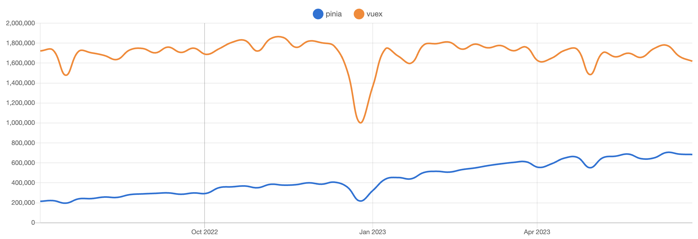

## pinia란?

기존 vue의 전역 상태관리 라이브러리는 거의 `vuex`가 독점하다시피 한 시장이었다. 옆 동네 react만 하더라도 `redux`,`recoil`,`MobX`,`zustand`와 같이 여러 라이브러리 중에서 선택할 수 있었지만, vue에서는 선택권 없이 사실상 99% `vuex`를 써야했다. 오히려 이 점이 학습에 대한 부담(여러 라이브러리 두루 알고 있어야 함)을 줄여주기도 했지만, vuex의 아쉬운 점을 대체할 수단이 없다는 단점을 껴안고 있었다.

그러다가 2019년 11월에 `vuex`의 experiment to redesign(리디자인 실험)으로서 `pinia`가 처음 출시되었고, 현재는 `vuex`를 대신하여 vue의 공식 상태관리 라이브러리로 자리잡았다. 이름은 달라졌다고는 해도 `vuex` 개발팀이 `pinia`를 개발했기 때문에 기존 `vuex`의 기능과 문법은 거의 바뀌지 않았고 새로 학습해야할 내용도 부담 없는 수준이다.(공식문서에서는 `pinia`를 `vuex 5`의 다른 이름이라고 소개한다)

[npmtrends](https://npmtrends.com/pinia-vs-vuex)를 보더라도 `vuex`와의 격차가 점점 줄어들고 있음을 확인할 수 있다.


## vuex와 비교해 달라진 점

#### 1. 다중 store

`vuex`에서 여러 종류의 store를 사용할 경우 일반적으로 modules 디렉토리 밑에 몰아넣고 `index.js`에서 하나로 합쳐주는 방식을 사용하였다.

```
// vuex
src
└── store
    ├── index.js
    └── modules
        ├── counter.js
        ├── user.js
        ├── order.js
        └── ...
```

하지만 `pinia`에서는 다중store를 지원하기 때문에 modules를 사용할 필요가 없어졌다. 따라서 stores 디렉토리 밑에 모든 store를 둘 수 있게 되었다.

```
// pinia
src
└── stores
    ├── counter.js
    ├── user.js
    ├── order.js
    └── ...
```

#### 2. mutation 없이 state의 직접 변경 가능

기존 `vuex`에서는 state의 값을 변경하려면 반드시 `mutation`을 통해야 했다.  
가령 `count`라는 state와 이 값을 증가시키는 `increment`라는 함수가 있다고 하자.

```javascript
// vuex
const store = createStore({
  state: {
    count: 1,
  },
  mutations: {
    increment(state) {
      state.count++
    },
  },
})
```

`count`값을 증가시키기 위해서는 반드시 `mutation`에 등록된 함수를 통해서만 접근해야 한다.
`store.state.count++`처럼 직접적으로 state를 변경시키는 건 허용되지 않았다.

```jsx
// vuex
<template>
  <p>{{ $store.state.count }}</p>
</template>
<script>
  ...
  setup(){
    // store.state.count++; // 직접 변형 불가
    store.commit('increment'); // 반드시 mutation을 통해서만 변형
  }
</script>
```

<br />
<br />

하지만 `pinia`에서는 `mutation`이 사라지고 값의 직접 변형이 가능해졌다. 따라서 매번 state값을 변경하기 위한 `mutation`함수를 만들 필요가 없어졌기 때문에 상당히 편리해졌다.

```javascript
// pinia
export const useCounterStore = defineStore("counter", {
  state: () => {
    return {
      counter: 1,
    }
  },
})
```

그러면 `counterStore`로 받아오기만 하면 된다.

```jsx
// pinia
<template>
  <p>{{ counterStore.counter }}</p>
</template>
<script>
  ...
  setup(){
    const counterStore = useCounterStore();
    counterStore.count++; // 직접 변경 가능
    return{
      counterStore,
    }
  }
</script>
```

#### 3. Typescript 호환성 증가

`vuex`에서는 도입하기 까다로웠던 `typescript`가 `pinia`에서는 쉽게 사용할 수 있다.

```typescript
// pinia
interface VueLib {
  state: "vuex" | "pinia"
}

export const useCounterStore = defineStore("counter", {
  state: () => {
    return {
      counter: 0 as number,
      library: {
        state: "pinia",
      } as VueLib,
    }
  },
})
```

## 프로젝트 도입 후기

#### 내장 메소드

- `$reset()`
- `$patch()`
- `$subscribe()`
