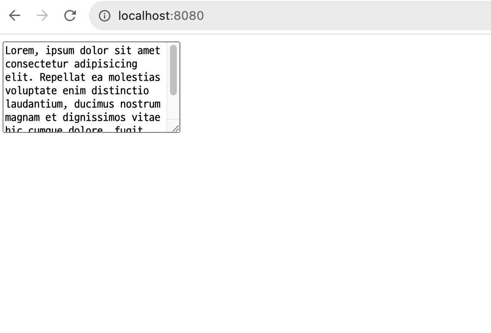

## nextTick()이란?

Vue를 공부하다보면 Global API의 한 종류 중에서 `nextTick()`이라는 함수를 접하게 된다.
[Vue 공식문서](https://vuejs.org/api/general.html#nexttick)에서는 이렇게 설명하고 있다.

> When you mutate reactive state in Vue, the resulting DOM updates are not applied synchronously. Instead, Vue buffers them until the "next tick" to ensure that each component updates only once no matter how many state changes you have made.  
> `nextTick()` can be used immediately after a state change to wait for the DOM updates to complete. You can either pass a callback as an argument, or await the returned Promise.

> Vue에서 반응형 변수의 값을 변경할 때, 그 결과는 DOM에 동기적으로 반영되지 않는다. 대신 Vue는 각 컴포넌트가 몇번이나 변경되었느냐와 상관없이, "next Tick"까지 버퍼에 담아놓아서 반드시 한번만 업데이트 됨을 보장한다.  
> `nextTick()`은 DOM의 업데이트가 완료될 때까지 기다리는 데 사용할 수 있다. 콜백함수나 `Promise`를 await할 수도 있다.

쉽게 얘기해서, '코드 상에서 데이터가 바뀌더라도 DOM에는 즉각적으로 반영되지 않으니 강제로 반영하고 싶다면 이 함수를 호출해라' 라는 의미다.

스크립트단에서 적용된 코드가 곧바로 DOM에 반영되지 않는다는 사실은 vue뿐만 아니라 react를 접해본 사람이라면 생소한 얘기는 아닐 것이다. 최적화를 위하여 화면을 그리는 렌더링 과정은 batch로 처리되기 때문이다. 그래서 react, vue 라이브러리를 처음 공부하는 시기에는 내가 생각했던 렌더링 결과와 다르게 나와서 당황했던 경험이 다들 한번씩은 있을 것이다. 그래서 이런 불편한 상황을 해결하기 위하여 `nextTick()`함수가 존재하는 것이다.

## 언제 사용할까?

사실 `nextTick()`함수의 사용빈도가 많지는 않지만, 가끔씩 필요한 상황은 있기 때문에 이런 함수의 존재여부를 알고있다는 자체만으로도 도움이 된다. 지금까지의 경험상 이 함수가 필요했던 상황은 크게 2가지였다.

#### 1. 비동기로 데이터를 받아온 후에 container의 size를 조정해야할 때

아래와 같이 `fetchData` 라는 비동기 함수를 통해 데이터를 받아와서 `<textarea />`에 보여주는 상황을 생각해보자.

```tsx
<template>
  <textarea class="container" v-model="data" />
</template>
<script setup>
  const data = ref("")

  onMounted(async () => {
    data.value = await fetchData()
  })
</script>
```

그리고 data가 담기는 `<textarea />` 에는 다음과 같이 `width, height, overflow-y:scroll`가 있어 정해진 사이즈로만 렌더링되어야 하는 제약이 있다.

```css
.container {
  width: 200px;
  height: 100px;
  overflow-y: scroll;
}
```

그러면 아래와 같이 화면이 보이게 된다.



여기서 한가지 요구사항을 추가해보자.

- `data`의 길이에 따라서 `<textarea />`의 높이가 자동적으로 조정되어야 한다. 즉 스크롤이 생기지 않고 한 화면에 모든 내용이 다 들어와야 한다.

단순하게 생각해보면 `height : fit-content`를 하면 될 것 같지만 실제로는 작동하지 않는다. 왜냐하면 `data`를 비동기로 받아오기 때문에 **화면을 렌더링하는 시점에는 아직 `data`의 길이를 알 수 없기 때문**이다.  
따라서 우리는 `data`를 받아오고 난 후(=길이가 얼마인지 알 수 있는 시점)에 DOM에 다시 접근하여, 그 길이에 맞춰서 다시 `<textarea />`의 높이를 `JS`를 통해 조절할 생각이다.

#### 2.
